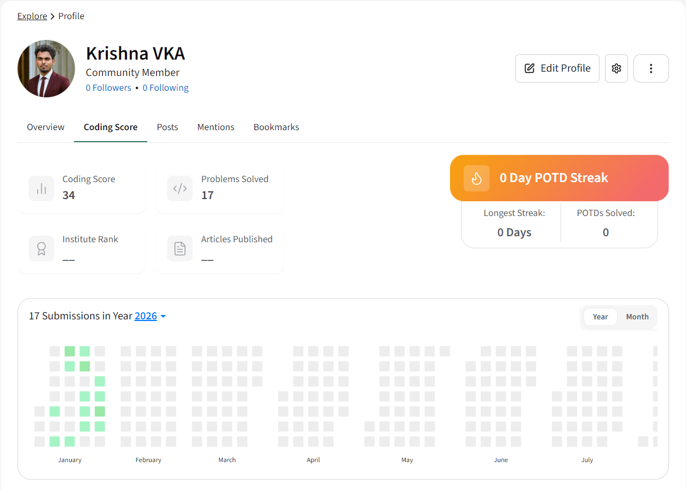
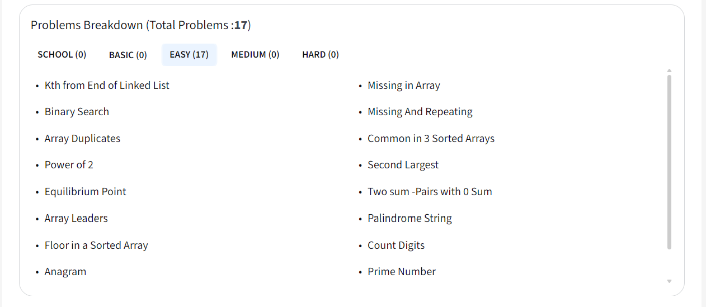

# 🧩 Problem Solving Achievements

This repo highlights my progress in competitive programming and problem solving.

## 📊 GeeksforGeeks
- Solved **XXX problems** on GeeksforGeeks  
- Profile: [My GeeksforGeeks Profile](https://www.geeksforgeeks.org/profile/learnsma3lgv?tab=activity)  

## 🚀 Why It Matters
Practicing problems helped me strengthen:
- Data structures
- Algorithms
- Logical thinking
- Coding efficiency
